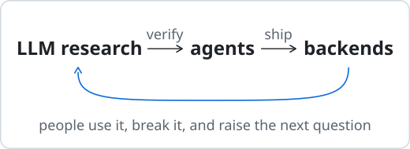
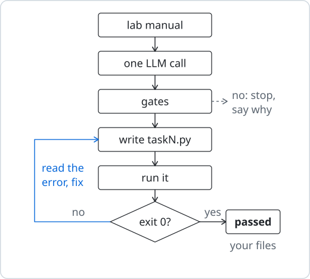
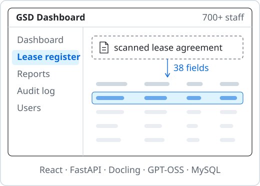
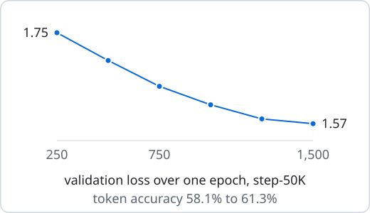
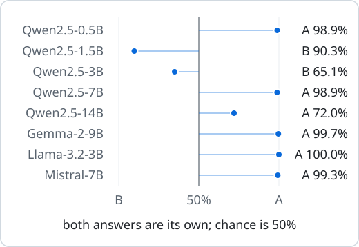

# Shehryar Ali

**AI Engineer** · Data Science, NUST Islamabad

I study how language models actually behave, then build with them: agents, the backends they run on, and the models underneath. Away from the keyboard, I'm reading or writing.

Before: AI Engineer Intern, Askari Bank Digital Lab.

## What I work on

- **LLM research & fine-tuning**: full-parameter SFT with TRL, completion-only loss, placebo-controlled evals, log-prob scoring, HF Transformers
- **Agents & tool use**: LangGraph, tool calling and tool design, guardrails, structured output (Pydantic), agent evals, prompt caching
- **Backend & APIs**: FastAPI, REST and SSE, SQL and NL2SQL, JWT auth, Docker Compose, GitLab CI/CD
- **ML & data**: PyTorch, scikit-learn, pandas, FAISS, MCTS self-play

## What I've built

**[Labs-Agent](https://github.com/shehryars715/Lab-Agent)** · in beta with my classmates 
Hand it a lab manual; an agent writes, runs and fixes the code.

**GSD Dashboard** · Askari Bank Digital Lab, 2026 
An agentic operations platform answering questions across lease, capex and procurement for 700+ staff.

**[Finetune](https://github.com/shehryars715/Finetune)** · models on [Hugging Face](https://huggingface.co/shehryars715) 
Instruction-tuning two Pythia-410M checkpoints, full-parameter.

**[MirrorTest](https://github.com/shehryars715/MirrorTest)** · paper under review 
Can LLM judges spot their own writing? Mostly, they just favour a letter.

## Skills

| Area | Stack |
|---|---|
| **Languages** | Python · TypeScript / JavaScript · SQL · C++ · LaTeX |
| **LLMs & fine-tuning** | Hugging Face Transformers · TRL · full-parameter SFT · completion-only loss · LLaMA · Qwen · Pythia · RAG · prompt engineering · zero-shot classification (BART-MNLI) · Gemini API · Ollama |
| **Agents** | LangGraph · LangChain · deepagents · tool calling and tool design · guardrails · structured output (Pydantic) · agent evals · context engineering · prompt caching · human-in-the-loop · NL2SQL |
| **Evaluation & research** | placebo controls · position counterbalancing · first-token log-prob scoring · AUROC and bootstrap CIs · blind eval sets |
| **ML & data** | PyTorch · scikit-learn · Logistic Regression · LightGBM · SMOTE · MCTS self-play · YOLOv8 · MediaPipe · pandas · NumPy · FAISS · ETL pipelines · data cleaning and annotation |
| **Documents & OCR** | Docling · Tesseract OCR · JSON-schema validation · fuzzy matching |
| **Backend & web** | FastAPI · REST · SSE · JWT auth · MySQL · Supabase · React · Vite · Tailwind CSS · Streamlit |
| **DevOps & tools** | Docker · Docker Compose · GitLab CI/CD · Git · AWS Lightsail · Trivy |

## Say hi

  

shehryar0707@gmail.com

