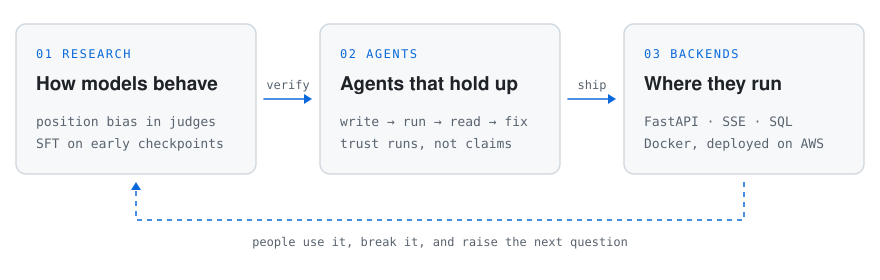

# Shehryar Ali

Data Science at NUST, Islamabad.

I research how language models actually behave, build agent harnesses that don't take
their word for it, and write the backends those agents run on.

  <picture>
    <source media="(prefers-color-scheme: dark)" srcset="assets/loop-dark.svg">
    
  </picture>

- **Now:** beta-testing [Labs-Agent](https://github.com/shehryars715/Lab-Agent) with my classmates
  before a public release. You give it a lab manual; an agent writes each task, runs it, reads
  the real output and fixes it.
- **Under review:** *Position Bias Breaks the LLM Mirror Test*, a placebo-controlled study of
  whether models can recognise their own writing. Mostly, it measures which letter a model likes.
- **Before:** AI engineer intern at Askari Bank Digital Lab. I led an agentic operations
  platform for 700+ staff: a router, a 24-tool orchestrator, and NL2SQL that is read-only by
  construction. Also research assistant work on LLM fine-tuning and Urdu data at NUST.

## Selected work

**[Labs-Agent](https://github.com/shehryars715/Lab-Agent)** · Python, LangGraph, FastAPI, React 
An agent harness for CS lab work. A fresh solver agent per task, four tools, turn and cost
budgets, and a task only counts as done after a real clean run. Checked by a 10-case eval
suite and 400+ tests.

**[MirrorTest](https://github.com/shehryars715/MirrorTest)** · Python, Transformers, statistics 
Eight open judges, 43,048 pairwise runs, placebo and likelihood controls. Llama-3.2-3B
answered "A" on 100% of 2,616 runs, which averaging reports as a harmless 0.500.

**[Finetune](https://github.com/shehryars715/Finetune)** · PyTorch, TRL 
Full-parameter SFT of two Pythia-410M pretraining checkpoints on Alpaca. The tuned models
learned what an answer looks like, not how to get it right. Both are on
[Hugging Face](https://huggingface.co/shehryars715), with 250+ downloads a month.

**[AlphaConnect4](https://github.com/shehryars715/AI_Semester_Project)** · PyTorch, MCTS 
Monte Carlo tree search guided by a policy/value network trained on self-play. The first
neural generation beat plain MCTS 81.5 to 18.5 over 100 games at 0.5 s a move.

## Notes to self

Things my projects keep teaching me:

- An agent with no approved way to stop will keep going. Give it one.
- An average can hide a broken judge. Run the placebo.
- A model saying it passed is a claim. A clean run is evidence.
- A prompt asks. A guard guarantees. Ship both.

## Tools I reach for

Python, PyTorch, Hugging Face, LangGraph, FastAPI, SQL, Docker, React.

## Contact

shehryar0707@gmail.com · [LinkedIn](https://www.linkedin.com/in/shehryars715/) · [Hugging Face](https://huggingface.co/shehryars715)
